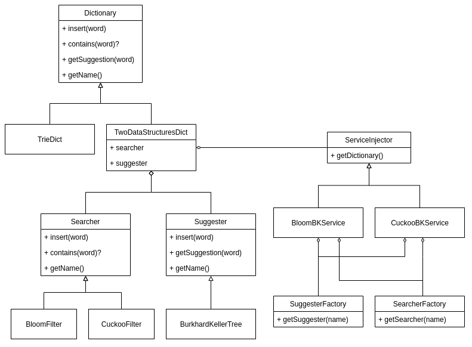

# Predictive Text

Check if a word is in a dataset and get suggestions for it.

## Problem

Given a set of files, each file contains multiple words. With a given word, decide whether it is in datasets or not. Give suggestions (words that similar) for that word.

## Solution

I decide to use an data structure to store datasets and handle user's requests. Let's call it `Dictionary`.

[Dictionary](/src/main/scala/dictionary/Dictionary.scala) is an interface. I implement [TrieDict.scala](/src/main/scala/dictionary/TrieDict.scala) as it direct child class. It uses [Trie](https://en.wikipedia.org/wiki/Trie) as the data structure for storing datasets and handling requests.

I also implement [TwoDataStructuresDict.scala](/src/main/scala/dictionary/TwoDataStructuresDict.scala), a child class of `Dictionary`. It contains two data structures, [Searcher](/src/main/scala/dictionary/searcher/Searcher.scala) and [Suggester](/src/main/scala/dictionary/suggester/Suggester.scala), the former is used to check if a word is in the datasets or not, the latter it used to get suggestions for that word.

For `TwoDataStructuresDict` to get `Searcher` and `Suggester` at run-time, I use a [Design Pattern](https://en.wikipedia.org/wiki/Software_design_pattern) called [Dependency Injection](https://en.wikipedia.org/wiki/Dependency_injection), that is implemented after interface [ServiceInjector](/src/main/scala/dictionary/service/ServiceInjector.scala). That `ServiceInjector` will inject specific `Searcher` and `Suggester` to `TwoDataStructuresDict`.

For more detail, see the `diagram` below:

